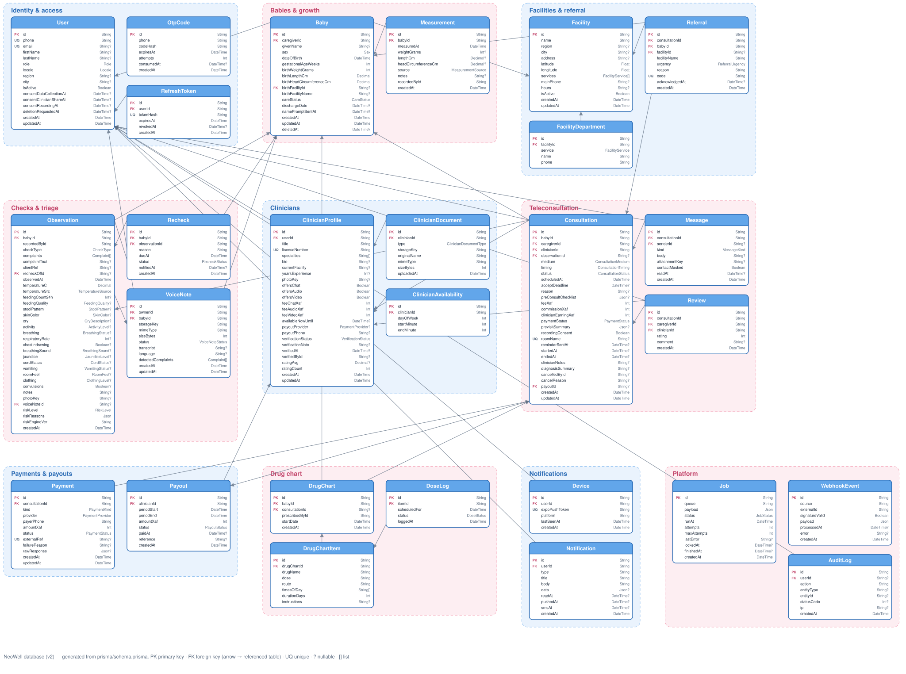

# NeoWell — Design Documents

| # | Document | What it covers |
|---|---|---|
| 01 | [Requirements Specification](01-requirements-specification.md) | Users, functional requirements (with IDs), non-functional requirements, triage rules v0.2, and traceability to the product meeting |
| 02 | [Database Schema Specification](02-database-schema-specification.md) | Every table and field, relationships, data rules, lifecycles, retention |
| 03 | [Database Diagram](03-database-diagram.excalidraw) | The schema drawn in Excalidraw (open at [excalidraw.com](https://excalidraw.com) → Open). Preview: [SVG](03-database-diagram.svg) |
| 04 | [API Endpoint Specification](04-api-endpoint-specification.md) | Endpoints by module, who may call each, and the requirements each serves |
| 05 | [Background Processes Specification](05-background-processes-specification.md) | Scheduled jobs, queued jobs, on-device reminders and incoming webhooks |
| 06 | [Technology Stack and Assets](06-technology-stack-and-assets.md) | Frameworks, packages, third-party services, assets, environments |
| 07 | [Front-End Design Guide v1.0](07-frontend-design-guide-v1.0.md) | Brand, tokens, components, every screen, navigation and code structure of the mobile app |



## Keeping the docs in sync

- **Schema:** after changing `prisma/schema.prisma`, regenerate documents 02 and 03:
  ```bash
  python3 scripts/docs/gen_schema_doc.py
  python3 scripts/docs/gen_diagram.py
  ```
- **Triage rules:** when the rules change, update §6 of document 01 and the engine version in `src/triage/risk-engine.ts` together.
- **Endpoints:** add new endpoints to document 04 with the requirement IDs they serve.
